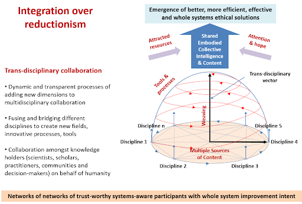

# Global Challenges Collaboration - Proposal for Global Governance
in response to [an RFP issued April 2017](https://globalchallenges.org/about/history/new-shape-prize/)

## 1. Abstract

Our ‘Global Challenges Collaboration’ is a call to action for a broad and diverse microcosm of nominated and recruited people who deeply feel the need for transformative change, and are willing to opt-in to bring their respective expertise and experience to co-design and work together, as if our future depends on it. Because it does.

Systems of governance, legal doctrines, technological innovations and our social systems are rapidly evolving. We are engaging people who are active mindful practitioners in these areas, and bringing to light the projects, best practices, and ways of knowing, being, and practicing that demonstrate holistic, cooperative approaches to the challenges we face.

We purposefully do not present a finished governance model; we present an approach to evolve the best possible governance model for creating a more and more collaborative and peaceful world.

Any model we create will be only as good as the times in which they were born. Models that are founded on time-proven principles, and adaptable to context-relevant circumstances, are needed.

Our proposal is literally a work in progress. We have come together to bring our best ideas and our best work together to synthesize and facilitate a staged process of engagement, practice, integration and demonstration-by-example. We emphasize a deliberate, sincere, and foundational core principle that deep consideration, interaction, exploration, and co-evolving ideas is an approach that has the best opportunity for scaling our collective wisdom.

We start by deeply honouring the individual complex beings we are, acknowledging the need to show up fully present. We see that mutual empathy builds our social cohesion through sharing our stories, values, and our knowledge as we once would have around the campfire. We need spaces to hold the complexities of our situation, and tap into the understanding that our diversity brings. We see the need to build trustworthy relationships among people of like and unlike minds to truly understand the systemic issues facing humanity today. This trust-based bridging of understanding is core to our model.

## The preamble of the Earth Charter (1991) advanced an imperative challenge:

“We must join together to bring forth a sustainable global society founded on respect for nature, universal human rights, economic justice, and a culture of peace. Towards this end, it is imperative that we, the peoples of Earth, declare our responsibility to one another, to the greater community of life, and to future generations.”

Many of our peer team members are designing technology, have developed practices, and have projects that meet our challenges, but are in competition with each other - and the truth is, no solution can be sustained in a vacuum or can solve the problems we are facing alone. Our proposition advocates for supporting collaboration and cooperation directly - so that we can leverage each other’s work, see what we all bring to the table, identify points of intersection and build coherent and supportive relationships.

We understand that what is needed is disruptive innovation at the whole-system scale, yet this transformation is most likely to be achieved through many smaller interventions within a more holistic system ethic that puts Earth and collective humanity ahead of individual gains.

## Stage 1: 
Convene small group to write proposal; integrate as best we can the work that we all bring; and practice the sharing of power between us to inform our best practices, to be tested, fed back on and improved. Complete first task: submit proposal September 30.

## Stage 2: 
Beginning now, and continuing beyond September 30, profile each other's work, convene sensemaking conversations between us to define our context, our commonalities and differences, the resources we bring to the table, and begin exploring and planning interventions and collaborations. Increase adoption and integration of the ideas and practices presented, as our personal and collective capacities grow.

## Stage 3: 
Weaving the whole. Propose and adopt agreements between us, demonstrate methodologies of engagement and ways of being, knowing, and collaborating that we use to model the best practices we are discovering and incorporating into our evolving practices.

## Governance Model

The best governance model will be created by starting with an opt-in, deliberative governance process, designed, tested, augmented, and refined by peers. It is guided and informed by our common values, common sense, and common sensemaking practices; and by creating spaces where people can bring their whole selves to speak their truth.

We invite the contribution and leadership of each person in a cohort of peers, to add their contributions to an ever-growing whole-system vision where we recognize the value of every human being, and the value of a healthy and regenerating world.

We begin with meta conversations about what currently exists from a diversity of perspectives. For us to create a global governance model, we must first understand the current structures of power as they exist today - particularly their deficiencies in addressing social needs and supporting citizen stewardship.

We recommend that participants do a three part series of discovery conversations, to be recorded and shared as decided by participants:

- Nominate a person you are curious and inspired by. Invite them to share their work, how that relates to our global challenges, and the role they would like to play. Discuss how their learnings, gathered through real experience (not just academically), can be integrated into our values, principles, practices, tools, and governance model.
- Switch roles in a second segment, and share your work with them, while they are guided by their reciprocal curiosity;
- A third session, in which both identify points of alignment, complementarity, or difference, and explore opportunities to amplify each other’s efforts.

Following these discovery conversations practices and structure, we invite our peer groups to convene conversations between themselves, to find the points of intersection and difference, with a goal to deepen and broaden their understanding, identify where their work intersects, and connect their work in the ways that serve the collective emergent vision.

We will incorporate our learning and share our developments as a living story in process.

## 2. Description of the Model

Foundational to our model is the recognition that every person is of value and has something to offer. Following is a list of our growing list of assembled collaborators While we understand that our authors may NOT be specifically identified, we feel it is vital to recognize the 'shape' between us, and the diversity, life experience, accomplishments, and possible contributions that derive from such a rich and growing membership of collaborators all sharing key core values and reinforcing each other’s current projects and possible new initiatives, and all wanting to learn and co-create with each other.

### Collaborator 1
C1 is a maverick and renegade who would like to see us create and engage with in a ‘mirror’ of the UN. C1 was the person who instigated this proposal, and brought together the first participants.

### Collaborator 2
C2 is founder of a startup which has recently been awarded the largest share of a EU-funded project to create an API and app framework for the music industry. This startup offers this work as open source for us to connect projects. This startup’s technology could be used to create an app that anyone can use to authenticate to online democracy services like Change.org, MoveOn.org, Avaaz, etc., and submit their opinion so that anyone, including media organizations and decision makers, could get aggregated data presenting public opinions on specific issues, thereby broadening our visibility and impact as a movement.

### Collaborator 3
C3 is co-chair of a community credit union, a peer to peer media practitioner, and an advocate for social and economic change. C3 sees the value in each person’s contribution as part of a greater whole. C3 offers a framework for intellectual and social value, a peer to peer podcast model, and a vision for how we can leverage our work by supporting each other as sovereign actors meeting our global challenges as a movement.

### Collaborator 4
C4 is co-founder of a startup, a data scientist and STEM research scholar, who stewarded the Finding Aldea project. C4 is an applied game theorist whose Master’s thesis was was focused on ensemble learning as a model for collective decisionmaking.

### Collaborator 5
C5 and their team at their startup have created an innovative tool to deepen democracy and community participation. It’s all the functionality a group needs to listen, discuss, find agreement and make informed and transparent choices together.

### Collaborator 6
C6 is a teal practitioner and transformation mobiliser who connects people, organizations and technology, questioning the impact of technology on groups of individuals in hindering or promoting change. C6 works as a sensemaker and catalyst, encouraging people to organise themselves into better alignment with their environment, through using creativity and offering alternative perspectives, co-creating actionable change and delivering shared value.

### Collaborator 7
C7 is a filmmaker and video journalist for Ecologist.org. C7 serves as a change agent by creating promotional videos primarily for charities, NGOs, community projects and social enterprises.

### Collaborator 8
C8 is steward of a community health hub, a peer to peer community engagement platform that helps groups and individuals connect with their local healthcare, wellness and prevention while helping providers and services target communities, groups and individuals.

### Collaborator 9
C9 works with C5, and has stewarded several democracy projects prior to bringing skills to this team. C9’s strengths in game design and development, with a special interest in democracy, bring significant depth and technical experience.

### Collaborator 10
C10 brings a web of projects from the nascent domain of collaborology, embracing and inspired by the work of Douglas Engelbart. C10 is developing principles, tools, protocols, and practices that serve to give us the frameworks for scaling successful collaboration. C10’s work provides frameworks that are directed at realizing the global village we all can thrive in, using practices for human-system and tool-system coevolution.

### Collaborator 11
C11 consults, trains, and advises organizations to achieve what seems impossible, but is merely difficult. C11 has led product development teams involving over 100 people in launching complex products that were a combination of hardware, software, and firmware. C11 helps groups of people rapidly become truly well-formed teams, so that they can achieve what would be impossible for any individual acting alone.

### Collaborator 12
C12 is a technologist and accomplished problem solver. C12 is steward of a technology user group, and supports a network of technologists to share their knowledge and tools to build community.

### Collaborator 13
C13 is a go-getter, bricoleur, and connecter of communities and ideas. C13 works on education for young and old, dialogue formats, peace making and creating models and mental architectures towards common patterns, fields, and frames of reference in shared systems and models.

### Collaborator 14
C14 is a graphic facilitator and systems thinker. C14’s work creates visualisations of any organisational issue, be it business, political or cultural, to help groups to clarify and visualize their vision and missions.

### Collaborator 15
C15 is an analytical visionary, who pursues new and innovative ideas with a focus for uncovering the truth of their viability. C15 brings creative energy and a foundation of well-researched knowledge to work, and works with Maori and settler cultures to bridge difference and connect knowledge to support change.

### Collaborator 16
C16 is a marketing specialist and co-founder of an artist media agency, and a community living project. The agency is a media and marketing shop in London, with design, development and marketing experts on hand to give anyone the support they need to get their project optimized for public release.

### Collaborator 17
C17 is founder and systems architect for new currency systems and an alternative to the blockchain as a sovereign and accountable commons. C17 stewards several teams, including agile learning centers, and is currently focused on designing and developing tools that rebuild our whole computing and communications stack and which are natively semantic, decentralized, and cryptographically secure.

### Collaborator 18
C18 is an entrepreneur and senior engineer for an app to help people get outside. C18 is passionate about using technology to help solve important social and environmental problems. C18 has a technical background and yet also an ability to bridge the technical and non-technical worlds. C18 worked as the lead data integration engineer for a data company, helping customers publish high-value open data.

### Colalborator 19
C19 is a creative strategist, systems thinker and founder of a community media hub, an investment coop, and an impact economy summit. With a background in network management, C19 is a key convener of conversations that are of interest and importance in new economy thinking. C19 is driven by what they see as an 'infinite realm of possibilities', which become apparent when people, communities, and values unite.

### Collaborator 20
C20 is a Holistic Health Coach and a founder of a wellness company. With a focus on health and healing, C20 has a wide toolkit of skills and abilities, working as live blood analyst, family constellation facilitator, and teaches ‘Return to Right Relationship’ in a deep ecology, whole system context.

### Collaborator 21
C21 brings a wealth of knowledge in governance and community led decision making carried through his lived experience in communities as a systems thinker, trans-disciplinary change agent, social entrepreneur and specialist generalist. C21 enables complex systems-based collaborative responses to compounding global issues of climate change, carrying capacity, resource scarcity, indigenous enterprise creation & biodiversity loss. C21 integrates and articulates complex issues in real time as 'keynote listener' and 'productive synthesizer' by 'disrupting coherence compassionately' and asking where to, what if, and why not, and invoking the responsibilities of the assembled group.

### Collaborator 22
C22, with a BA degree in Sociology, trained as a child psychotherapist, worked for 15 years for NHS, then left to follow a deep spiritual path for 25 years. Participated in Transition Towns, and Occupy. Initiated groups in Leeds on Awakening Consciousness, and Non Violent Communication. Sees the deep disparity that is created through hierarchical power relationships, published articles on health, and sees that a transition to new ways of being requires awakening to the evolutionary consciousness of a universal humanity, and producing a fundamental transformation of how we organise ourselves.

### Collaborator 23
C23 is a social media influencer, photographer, model, actor, artist, and advocate for invisible illness. C23 lives with Ehlers Danlos Syndrome, and inspires us all with their capacity to overcome the physical pain they deal with while making beautiful art and raising awareness about issues of importance.

### Collaborator 24
C24 is a founder of a global media organization and a crowdfunding specialist. C24 is a visionary and creator, with special skills and interests in marketing, fundraising, public speaking, public relations, negotiations and conflict resolution, coaching and training. C24 supports leveraging technology and innovation to help us come into balance.

### Collaborator 25
C25 has over 30 years experience in the publishing, graphic arts and technology fields, and is an early adopter of modern electronic publishing technology and processes. C25 has a broad base of technology consulting experience for many industry sectors, and is driven to apply technology solutions to improve business processes or support previously unfeasible new opportunities.

### Collaborator 26
C26 is a core steward of a wisdom community, as an organizational development director and whole systems design consultant. C26 works with community currency projects, with a special focus on collective intelligence. C26 supports the design of circular economies for the Commons, and has focused on Wealth Stewardship to be able to create new relationships in the investment world.

### Collaborator 27
C27 is an innovative communications designer and deep thinker on systems change. C27 sees the need for us to design global systems together. Their guiding question: what if we simply decide to create a more beautiful human world? We could just slowly, meticulously, and playfully evolve all our systems of living to spectacular heights, just like great nature has been doing for millions (and billions) of years already.

### Collaborator 28
C28 is a researcher and PhD Candidate at the Center for Systems Studies. C28 is a leading thinker in Pattern Language, with a special focus on Pattern Language for Systemic Transformation. C28 is interested in highlighting and amplifying transformative processes by drawing perspectives from various disciplines and by making them visible and actionable through learning and collaboration tools.

### Collaborator 29
C29 is founder of the consultancy practices to empower mothers, children, and youth to build sustainable communities and responsible businesses, using the Collaborative Sustainable Community Development Model.

### Collaborator 30
C30 is a community currency engineer, and has been stewarding the Credit Commons Collective, an initiative by the largest complementary currency networks to build towards interoperability. C30 is also co-author of the Money & Society MOOC, a free online interdisciplinary Master’s level course at the Institute for Leadership and Sustainability at the University of Cumbria.

We share this to to indicate how deep and wide the collected knowledge and experience the collected team brings to leverage as we work, learn, and co-create ways of living together, and ways to govern ourselves.

## Theory of Change:

Through empowering each person to own and have direct agency over their own voice and experience, image, and representations of their work, we create the foundation and context for peer understanding, co-innovation, deep democracy, economic emancipation, and for the greater story of what is possible to emerge and how it can be processed and structured.

Through convening conversations between thoughtful collaborators, and creating a transparent record of podcasts and other artifacts that profile our work, we make our work visible to each other and to the public; to explore the points of intersection and complementarity between us; and to execute specific interventions (conversations, conferences, initiatives, projects, ventures, movements) that can embody our collective work and help each other progress as a movement.

We provide access to these dialogues and engage with institutions and regulators as determined by each group of collaborators. This is a practice of empowering a democratic model of engagement as a decentralized, bottom-up approach, whereby the participants identify how to best engage with current structures of power in ways that represent our purpose, goals and values.

These goals will take concrete instances of collaboration, build understanding across differences, and create a rich collection of conversations and real time collaborations that help us all to understand our key challenges more fully, and act thoughtfully upon them.

Our seed question:What are the ways we can support and engage projects for the greater good to encourage broad collaboration and cooperation as a movement?

From these conversations, we find opportunities to explore mutual resonance and amplification, where projects are aligned and can multiply impact by gestures as small as mutual reference and support, to as large as really impacting the mindset of the entire planet.

These opportunities will find seed in our conversations, will explore their own missions, goals, values, organization models, and will add to our collective impact, but with a built-in community-shared vision that has at its disposal the energies and impact of the collected strength, resources, and ever-growing membership of collaborators.

These various projects, impacts, and governance models will be shared transparently within this community to stimulate and catalyze collective learning, to iterate, learn from, and revise our practices, governance model, and our understanding of what scalable collaboration requires to be successful.

## Context and Assumptions

We are in a shift of paradigms. As an evolutionary response, this project aims to seed, model, practice, evolve, replicate, tailor and scale ways to cooperate and collaborate iteratively through co-creation and co-evolution rather than operate within the existing prevailing paradigm of competition.

We seek to work in relatively short periods - in agile terminology, sprints - where we discuss, agree upon, and adopt a set of ideas, and at the end of the sprint, readjust how we do this by analyzing what we do well, what we didn't do well, what we will do next, and what we still do not understand.

The goal of our model is to create ways to engage first with each other and out of this collaboration into the world that demonstrate cooperation, common sensemaking, and build towards interoperability. Our systems of governance and citizen engagement are and will be ever-improving, and we will bring our tools, practices, collective intelligence and technologies together to co-evolve integrative governance models. The emergent governance model will be the product of our collective learning, practice, and refinement, and will exemplify what it takes to incorporate thoughtful, well-integrated contributions from all participants in accordance with our shared values and shared vision.

As with any community, part of orienting ourselves is agreeing on what we mean by certain terminology. This is integral to the formation of any group, and we see it as an ongoing work in progress as we gain understanding of each other, the communities of focus we inhabit, and the broader context which we are part of.

One of our collaborators has developed an initiative that acknowledges that though we may all recognize familiar words as they appear in interaction, the ways we use words, phrases, terms, all reflect our differing education, work context, cultural context, and vernacular usage. When not clarified, these misunderstandings typically arise late in the stages of projects, when they are most expensive and most difficult to correct. This initiative empowers each of us, and our teams, to “travel with our own language”, to encourage the examination of different usage and definitions, and to promote the steps required to arrive at a suitable glossary that the team explicitly decides to adopt, while still allowing for refinement as new collaborators are recruited, or new team partnerships are formed. We have such samples of this in practice.

This project is part of a broader initiative, exploring and developing the values, principles, practices, constraints, guidelines, and tools for scalable successful collaboration, in a nascent domain of study we call collaborology. One of the tools is the Communication and Commitment to Collaborate (CCC), which is a short but structured invitation and open expression of the desire to work together, something that can accelerate a potential collaboration that can be exchanged and function like something between a business card and the signing of a contract. It clarifies and shares a person’s intentions, commitments, and responsibilities, and provides a basis and an opportunity for anyone to align their efforts towards the common good. We can provide samples of this in practice.

Within collaborology, the co-creators have developed a set of practices & tools as a framework for managing action items and simple agreements - the smallest atoms of collaboration. It handles negotiation protocols, and extensible semantics so that it can scale to complex projects, but enables addons such as analytics, extraction of interaction patterns, and the foundations of reputation. It is intended to be embeddable, unlike many of the currently popular stand-alone apps that are now seeing some adoption today like TODOist, Asana, etc.

We seek to develop an environment of ‘executable knowledge’, so that we can create simulations to support ‘what if’ explorations that allows each of us to further refine knowledge, models, and simulations so that we may converge on viable solutions, decisions, and action plans, rather than merely debate.

As our collaborations grow and evolve, we will collect compendia of lessons learned, documenting that learning so that we may guide future generations with relevant, real-world knowledge that is adapted to the world context in which they were born and grow, rather than learning from statically specified lesson plans set decades earlier from an obsolete era.

## The Model

In terms of product, this project creates a context for a global collection of shareable dialogues, amongst peers, to go deeper into the complexities of our circumstances so we can see where the situation assessment and/or decision making is breaking down or ineffective. Each of us brings a range of skills, prior work, practices and histories. You will see different voices, and styles. That’s because each of us sees a part of a whole, snapshots of the territories we’ve covered, that we hope to reveal together as our collaborations evolve.

In terms of governance, we propose a diverse stakeholder, whole system approach. In order to achieve "effective ways of making collectively binding, long-term decisions that take into account the interests of all those affected, including future generations" we need to reach out initially to transformative thinkers, systems designers, developers, practitioners and project leaders, but we also recognize that it is critical to integrate the direct feedback and experiences of all stakeholders, particularly people most affected by the challenges we are aiming to resolve, and to take into account the effect on future generations. We will achieve this with various methods including large group facilitation.

Stages of the Model: Opt-in Agreement, Observe, Engage, Profile, Assess, Design, Execute, Feedback

We are gathering a growing group of people to carefully co-design governance models that can be used by anyone to make decisions together, and influence decision making at scale.

## Opt-in Agreement

This is an invitation to bring our work, skills and abilities into a cooperative enterprise. At each stage, participants will be asked if they agree with the seed premise of the community, the protocols of engagement, and to make specific agreements together. Input and feedback is welcomed and considered for refinement.We believe that all of us have the capacity to create value, which is one of the core purposes of this proposal - the recognition, creation, and distribution of the value that we create as a movement as we focus our collective attention on the challenges we face. We propose to create shareable content that contains intellectual and social value, to raise awareness, and to support broader engagement with people who opt-in to this effort as well as society at large.We each retain rights to co-created media or digital assets, their attribution, how to share broadly, and how to share expenses and income from these assets transparently.

## Observe

Detailed information from a variety of sources is essential to see issues from the different viewpoints of those involved.

We invest time and effort in our common understandings of the issues that we face, to broaden our view of the critical issues, what has led to them, current ways we deal with them, and new and emergent ways we can adopt to be able to have a deeper, more complex, full system approach to observing and responding to the current state of affairs.Fundamental and prerequisite to collaboration there is great value in understanding the work of our peers to see the breadth of responses that people have been developing to our challenges. By presenting that work for us all to share and engage with we can gain greater understanding of our group context and specific actions we can take together.

One of our challenges is agreeing on a common context. In our onboarding process we ask our cohort of collaborators seed questions so we can assess our collective context and potential impact.

- What are the greatest challenges facing humanity today, from your perspective?
- Do you have a vision for how things can work better collectively, or specific interventions, ideas, or projects that you think can effect important change?
- How do you see yourself contributing or participating?

From the discussion responses we can derive matching needs and resources, get a broader collective view of the challenges of today from a variety of perspectives, and make ourselves, and our work, visible to each other.

We explore a range of models, taking all forms, to present these in a way that can easily be seen and browsed by all participants.

## Engage

The ways people connect and interact will vary with their culture and their personal choices. We identify here some available options to support engagement at a deeper level, to enrich the collaborative experience.

We may see the world as Laloux suggests 'as a place where we are called to discover and journey towards our true self'. Engaging with our whole selves can be very different from the mask we usually wear in public situations. Our need for control, to fit in, to look good, can shift towards increased acceptance of ourselves, others, and life. The ability and willingness to engage at this deep level will depend on our capacity for inner work.

We provide agreements and recommended practices to support bringing our vulnerabilities, fears, shame, which we may normally try to hide. The safe spaces agreement is a foundation for that shift, together with allowing time for interaction on a personal level, opening up to each other, encouraging conversations that nurture trust, empathy and compassion. Starting every meeting with a silence or other practices that support participants in being present, having small group breakouts, mindfulness, sharing circles, can all contribute to increasing trust towards those with whom we may disagree, or view as our adversary.

## Profile

We invite a diverse set of change agents to participate with us, to support this collaboration, and to share our ideas together. The goal is to showcase our work, find points of intersectionality, and connect where inspired and appropriate. Participants are encouraged to use and build on the questions suggested in our observation stage: What are the greatest challenges today, from your perspective? What are the barriers you see? How does your work meet those challenges? What role do you personally want to play? And what help do you need? These questions can allow us to come from a common context, so our collective work can hang together more easily.

This is an exploration of value creation, 'paying attention', giving our interest, and making our work visible to each other in a generative process that can be followed and tracked by a broader audience. It's working to codevelop a model to explore the currency of conscious attention, to create value directly, and to focus more awareness on our collective work as a response to the challenges we are faced with.

We seek to profile our collaborators using common framing, such as suggested above, so we can tag and sort their contributions to make them visible to each other. We are promoting a podcast framework for this, and attaching a crowdfunding initiative to it, so we can compensate participants for their contributions and share their work in a rich media format. Each podcast can be used to engage the participants’ community of impact, raise awareness about the initiatives, and garner public support.

We will also create blogs, infographics, synopses and reports from this work, as appropriate for engagement with the audience, decisionmaker, governing body, and constituency of focus.

## Assess

Once we have a selection of people and initiatives profiled, we can begin to see a greater shape and assess intersectionality, and see opportunities for interoperability, connecting initiatives intentionally, and developing relationships between projects with common goals.

Our process provides transparency by its very nature. We welcome feedback and assessments from anyone, to include and integrate insight, and to strengthen our ideas and the presentation of them.

## Design

In the design phase we will be making choices about how our processes, technology, and systems will interoperate, and where we can leverage each other’s work. Through the assessment process, we can identify where projects are complementary, and where we can extend each other’s work. In the design phase we will be working with the technical and process details to identify any barriers or challenges that arise, and work through them. These sessions can be recorded as ‘collaboration conversations’, to create a culture of accountability, transparency, and open design. Participants decide together if they are internal to the working group or made public as a way to follow along with the process.

The design stage produces and refines our governance model.

## Execute

This blends with the design phase, as the collaborations themselves are the execution of the process. We include it here to define a stage of transition and completion; agreements made, technological development done, and released to the public or the community of impact.

## Feedback

As a community, this is an opportunity to assess how well this framework for collaboration is working. Feedback is included here as a reflection point, is fundamental to the project as framed, and is encouraged at every stage of the process.

By creating spaces to think and reflect together, seeing the ‘emerging big picture’ more clearly, we integrate the offerings of all stakeholders, and take action towards specific interventions that demonstrate paradigms of cooperation.

Using communications technology to document the process of development, profile our collaborators work, and convene conversations between our collaborators, we can see where our work intersects and enable emergent synergies. This simple but profound innovation allows disciplinary (depth) specialists and transdisciplinary (breadth) neo generalists to cocreate a rich and diverse body of collective work that can be integrated, shared, built upon, and engaged with by anyone.

By modelling new ways of thinking, communicating and interacting, our proposal demonstrates new cultural habits of collaboration, incorporating our evolving technology for interaction, as advocated by our cohort of collaborators. We articulate our challenges, showcase our ideas and projects, and connect as change agents; to learn from each other, and identify collaborations, actions and interventions that can model and build the kinds of change projects that our collective intelligence indicates.

As a community of practice, we profile each participant, and create podcasts and other artifacts of their work, highlighting problems they are addressing, their obstacles, the connections and engagement they need, and any help they could use to bolster their efforts so they can share that with their constituencies of focus and relevant decisionmakers.

By identifying, brokering and creating opportunities for connection, and encouraging the conversations and syntheses that give rise to innovation, new principles, practices, theories, and models are demonstrated for wider-scale adoption and experimentation. We do this iteratively, incorporating strategies and best practices with each new source of ideas, incorporating our reflections and syntheses. In this way, we experiment with how we replicate or scale idea integration, and resolve disagreements, in a responsible, peer-accountable, non-hierarchical community that is seeking to maximize its impact through mutual support, and a growing coherence. This iterative reflection builds our individual and collective learning, coherence, cohesion, common ethics, capability and maturity in the emerging systems context.

One of the ‘products’ of this process, through employing and embodying a set of tools that are found to be useful, is a body of work that demonstrates the diversity and dynamics of creativity in the change agent sector, allowing us to better see ourselves in context, and connect us as a movement and community. The goal is to align our autonomous efforts into higher coherence and resonance - as a community of impact that in turn empowers communities toward better governance outcomes.

If a new, ethical, global responsibility-based model of political economy is to be brought forth, it can be done only by agreement between and among autonomous parties – in a non-centralized, non-hierarchical, non-dominating, discourse-ethical manner – not by political imposition and indoctrination.

Part of the ‘general governance model’ challenge is that governance happens at many levels, and is constrained by budgetary considerations, which are not always governed by the same bodies that need to respond to citizens. However, without higher level system ethical consideration we run the risk of continuing do the wrong things righter, and we’ll continue to create band-aid solutions that don’t hold a more global context. For example, continued highly efficient fossil fuel extraction and combustion is just a more cost-effective way of contributing to the accelerating pollution of our common atmosphere. We see a critical importance to catalyse, create and maintain the right conditions, the safe and nurturing environments, to hold higher level discourses for the system’s benefit of all, not the competitive advantage of some.

Communication between ‘levels’ requires empathy, understanding, different languages and terminologies to bridge the divides in worldviews, and, most importantly, the wisdom, consciousness, capability and maturity to recognise and hold and work with the differences. One of our challenges is that multiple worldviews interpret the same issues, especially existential crises, with conflicting perspectives.

We seek to grow our multicultural community of autonomous thought leaders, experts, neo-generalists, researchers, coaches, philosophers, and practitioners with deep relational connections to wisdom and knowledge holders in different cultures and institutions, to synthesize our work from what we have learned and incorporated in our careers, practices, and teachings. One of our foundational strategies is to invite and recruit those who have been concerned with these issues, and who are dissatisfied with current ‘states of teaching’ or ‘states of practice’, and seek to broaden this domain of knowledge to incorporate the values that can inform and demonstrate a thriving society.

Our individual practices and human development theories (including Integral, Spiral Dynamics, and Tao) inform us that networks operate at many different levels according to their system context; many of us are in multiple different networks and have to show up differently, often ‘un-whole’ in each. This is an unspoken burden, an unnamed ‘elephant in the room’—and many transformative thinkers must wonder how and where they can show up whole with their autonomy, belonging and competencies.

Aligning our intentions requires co-developing common systems context, a mutual understanding of crises or threats, diagnoses and analyses, and responses and syntheses. This is where each individual and network brings respective gifts, at the level they can, in full knowledge of how their part contributes to the collective whole, in emerging systems context. These are people who are open-minded enough to listen to potentially conflicting knowledge, open-hearted enough to empathise with each other and the whole systems they are interdependent with, and open-willed enough to contribute with others of unlike mind to accomplish tasks together with common systems ethical intent. Our driving question is ‘what is it we could do together better that we cannot do alone?’

We propose a staging process, demonstrated by the writing of the proposal itself, and engagement with our peers and communities.

The purpose of this is to take stock of our current context; listen to what our peers and communities bring to the table; and get a wider, whole-system view of the barriers to deep democracy as we design models of governance together as a growing practice.

## 3. Argumentation demonstrating how the model meets the assessment criteria

## 1. Core Values.

Our core values include diversity of perspectives, open participation and sharing, respecting each contributor and their contributions, with an opt-in culture of engagement. We value whole system thinking and development, and our process is to integrate values that are deemed important to our cohort of collaborators as we develop through time.

As a starting place, we submit the following systems, principles, protocols and values that represent work of ourselves and others that we respect, and seek to integrate in our work. As one of our core activities is to listen to each other, and to understand how our work intersects, we have included some broad strokes here, as a snapshot of our developing values as a community.

In terms of benefit to all of humanity, a core value is that we believe that all people are of value, and bring value to each other and the world. Our model seeks to show the value that we have, and demonstrate how helping each other creates the necessary support so we can engage with each other and the world as equals, and as peers of value to the whole.

Transparency - We believe that most decisions affecting stakeholders provide best accountability if they are visible. These include budget and policy. Secrecy disables accountability.

Value lens: 17 UN Development Goals; these goals are used to guide us in terms of global external impacts

## Adoption of 7 principles of cooperation

## -Collaborology protocols

- 8 Artifacts to seed a project team
- ‘Copywrite’ and content sharing agreements
- Opt-in participation, using a Communication and Commitment to Collaborate or other tools
- Opt-in privacy protocols; each member controls access to representations of themselves ie: opt-in sharing of podcasts that represent them
- Respect - Safe Spaces agreement
- We invest in each other, and create value by using each other’s work
- Decentralized non-hierarchical processes
- Open protocols
- Open source
- Transparent and accountable - all interactions are ‘on the record’
- Values based: serving the needs of the group and society

## 2. Decision-Making Capacity.

Our peer network-based model is a way for people to share their ideas, opinions and knowledge, to create sustainable solutions for all humankind, by supplementing existing decision-making processes, not replacing them. Each suggested solution is rated by transparent criteria so that everybody can see how ‘fit-for-purpose’ the solution is, assessed from various perspectives and criteria, by the users. Decisions need to be quick and easy for good next steps to be able to act immediately, and adapt and improve along the way.

In terms of how we work specifically in this project:

- Opt-in processes and protocols to come to agreements for participation;
- All collaborators can participate, and self select roles they want to play;
- All collaborators can engage with any other collaborator;
- All collaborators can be profiled in media for distribution within the cohort, or more broadly to the public if they choose;
- All collaborators can nominate specific conversations; conversation participants can accept or refuse; all members can modify the proposed content as they choose as a group;
- As a starting practice and to be evolved, nominated conversations can be vetted and accepted by a minimum of 5 members, given agreement to participate by the nominated participants;
- Advice-based decisionmaking processes: from Reinventing Organizations
- Holacracy and the Integrative Decision Making Process

## 3. Effectiveness.

Traditional power hierarchies, eg. pyramid structures, have proven ineffective when applied to complex adaptive systems issues. We base our decision structures on growth hierarchies that arise naturally through co-augmentation of skill, knowledge, motivation, etc, which is nature's way. Dynamic distributed control organisations are not easily specifiable or mappable. This is a process being explored, not a formula which can be applied across the board, and needs to adapt to regional differences and particular contexts.

In practice, we support each offering, and their efforts of collaboration in a transparent and flexible way, where the people investing the most are taking leadership responsibilities. This includes all stakeholders who will be affected by the decision, those who have experience in the topic, and those who have an interest. “Don't do anything about me without me.” The leadership is transparent, with all members given the opportunity to give feedback, critique, engage, or offer to co-lead if they feel they have a contribution. To facilitate this, the goals and assessment criteria of the initiative or approach are made transparent, as well as the process to add to or change as needed, in order to ensure input from the people who are motivated and capable of doing so.

Implementation is ensured by including in the decision making process all those who will carry out implementation. The more thorough people - especially the most affected - are part of the process, the more sustainable the implementation.

## 4. Resources and Financing.

Firstly, our key resources are ourselves, our experience, and the work that we each bring. These include systems, processes, protocols, insights, code, technologies, written work and representations of our work. Our responsibility is to see, understand, connect, and extend our individual work within the network of collaborators, to amplify our collective impact. We disseminate the work that we co-create to the communities to which it is relevant and the public for engagement, feedback, and application.

We invite all participants to host crowdfunding campaigns for the work they see is needed, and suggesting we disburse funds using tools such as Open Collective, that provide transparency and promote accountability.

We seek to create value for each person involved. Each collaborator has an opportunity to invest in any other collaborator by creating media and artifacts (including podcasts) with them, which have value by being shareable, and can be used to reach out to their constituencies of focus. The crowdfunding campaigns compensate each participant for the role they play, either as a participant or host, as well as to handle expenses of these creations.

## 5. Trust and Insight.

We are developing networks of trust, which come from the relationships between collaborators themselves. We support the trust within our networks by using tools like the Communication and Commitment to Collaborate (CCC), technologies including frameworks for a sovereign accountable commons, as well as open-democracy API protocols to connect democracy services, and Appreciative Inquiry, a participatory process that creates trust and full participation for achieving desired outcomes. We incorporate into collaborology our lessons acquired through practical application.Our goal is to agree to the premise of working together, test each other’s work through seeking to understand how our work interrelates, and propose and demonstrate interoperable applications to where our work intersects, and serves the greatest needs of humanity today.

## 6. Flexibility.

We will instigate meta-reflections where we regularly encourage participants to step back and assess how collaboration and governance is working, and if it isn't, give concrete suggestions as to what we could change to collaborate more effectively. Updating our ideas is an essential part of this process, as innovative thinking creates different strategies. This collaborative method constantly challenges being overly attached to one level of thinking. Being open to change individually and collectively is imperative.

We will be using Collaborology, Syntony, Sociocracy, Holocracy, Appreciative Inquiry, the learnings from Reinventing Organizations by Frederic Laloux as well as other bodies of work from our cohort to continually co-evolve our toolbox that we can use to integrate our governance model.

As our core mandate is to include the work of our cohort, and the work they draw from, this is central to our proposal.

## 7. Protection against the Abuse of Power.

Central to this proposal is that we evaluate where power is out of balance with the needs of humanity and the whole system we are a part of. We aim to shed light on those specific areas, and have open and transparent discussions about them.

In our observations as collaborators, we may see the challenges that existing systems within nation-states are out of balance. It’s our task to profile the diversity of special interests of individuals, groups, organizations, states or groups of states, so we can see the whole picture more clearly. Providing transparency and revealing the perspectives of all of them, we create a process that mitigates the power imbalances we experience in many administrations today. Also strict corruption rules must not only be implemented but also transparently executed.

## 8. Accountability.

There is a personal, a power, and a structural aspect to accountability.

- Structure: There needs to be a clear and transparent process in which accountabilities are decisive and visible for a certain role or unite by which they can be measured.
- Power: holding decision-makers and people overstepping their accountabilities accountable.
- Clarity of Intention, making and holding agreements on the basis of trust.

When we focus on seeing people as whole beings, interacting with deep compassion, what can be enabled is understanding rather than blame. This is an essential aspect of the peer system we have been describing above. For most of us, our lives have been dominated by 'power over' relationships within a hierarchical structure, from cradle to grave, so we do not have the opportunity to experience anything else. When we respect individual autonomy we can begin to build a world in harmony with nature and each other.

Holding individuals punitively responsible for their actions can encourage a culture of blame which often ignores the context, motivations and pressures which lead someone to act in a particular way, felt by others to be 'not good enough'. This judgmental attitude implies that we would have done it differently or better. In this way we all feel exonerated, when in fact we are all part of the problem. A culture of blame results in an expanding prison system, where punishment is still seen as an appropriate way to respond. When we share in a trusting environment we can begin to build healthy relationships built on mutual respect. We submit that this entire process is accountable.

By putting forward our ideas, supporting meta-reflections and ongoing governance meetings as a part of our development process, we ensure transparent accountability, at all levels of decision-making. This accountability is nested in all of our relationships and processes, in terms of clarifying the intentions of individuals to each other, making agreements that are specific and a part of the foundations of our work together, and following through.

**Note**: we have submitted one image, and provide one external link here:

- [Global Challenges Collaboration](http://globalchallengescollaboration.info)

Thank you for considering our proposal!
